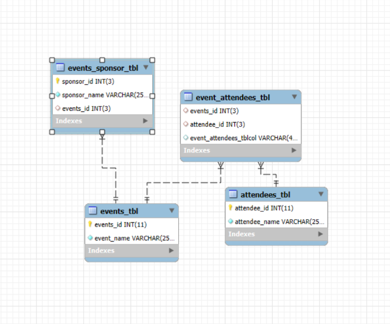

# Final Lab Task 1 - Events Management

## 1. Create Events_table

## 2. Create Attendees_table

## 3. Create Event_attendees_table

## 4. Create Events_sponsors table

## 5. ERD

## 6. Database Copy

[SQL Copy](https://github.com/monmanaloto/EDM-Project-Mon/blob/main/Final%20Task%201/copy)
