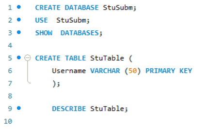
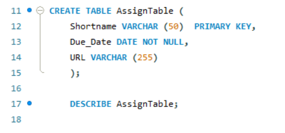

# Transforming ER Model to Relational Tables

## *Create the Student Table with Fields*

- username (STRING, VARCHAR(50), PRIMARY KEY)

## *Create the Assignment Table with fields*

- shortname (STRING, VARCHAR(50), PRIMARY KEY)
- due_date (DATE, NOT NULL)
- url (STRING, VARCHAR(255), NOT NULL)

  

  ## Create the Submission Table with fields

  username (VARCHAR(50))

- shortname (VARCHAR(50))
- version (INT)
- Submit_date (DATE, NOT NULL)
- data (TEXT)

  

  ## EER Diagram

  
